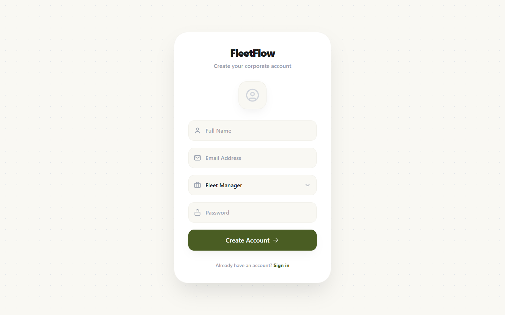
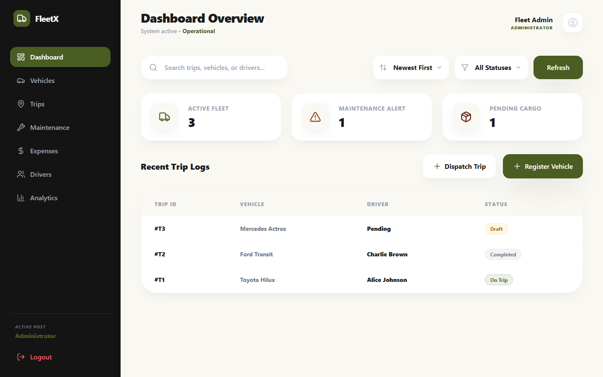
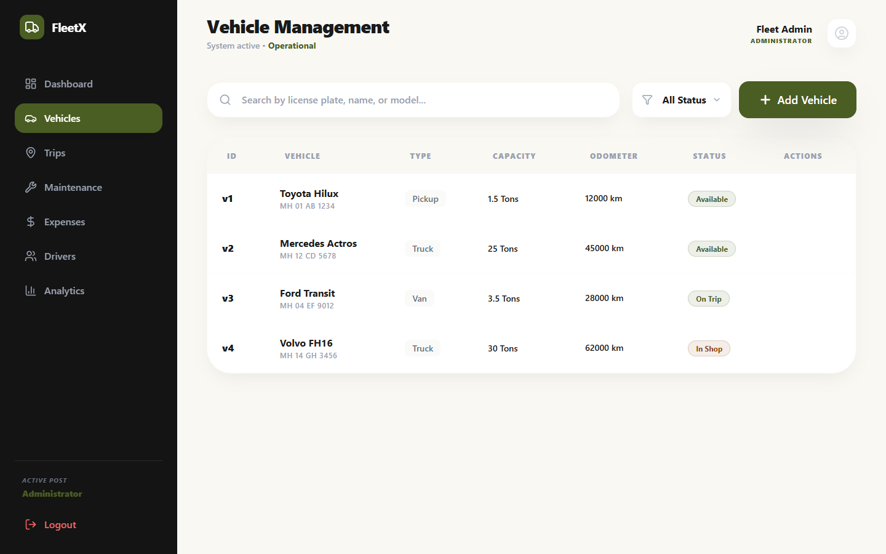
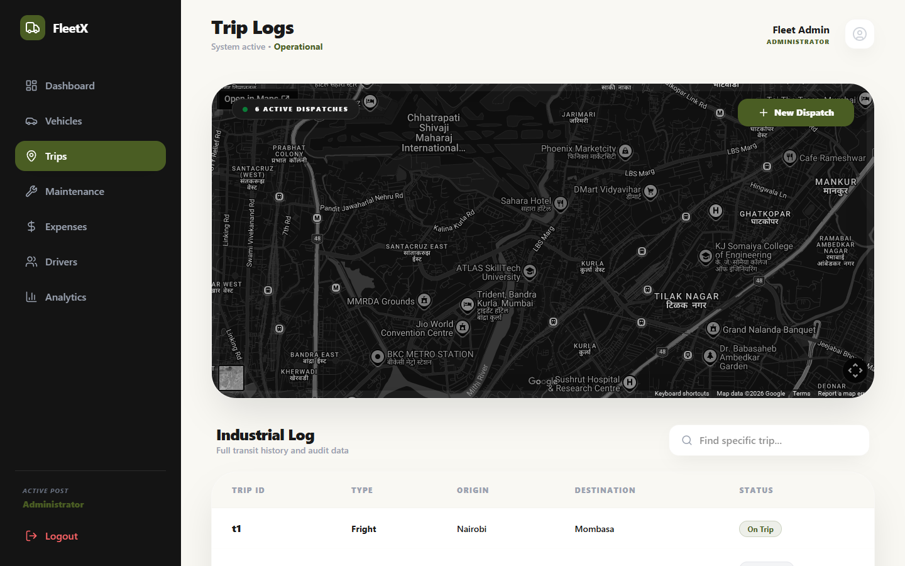
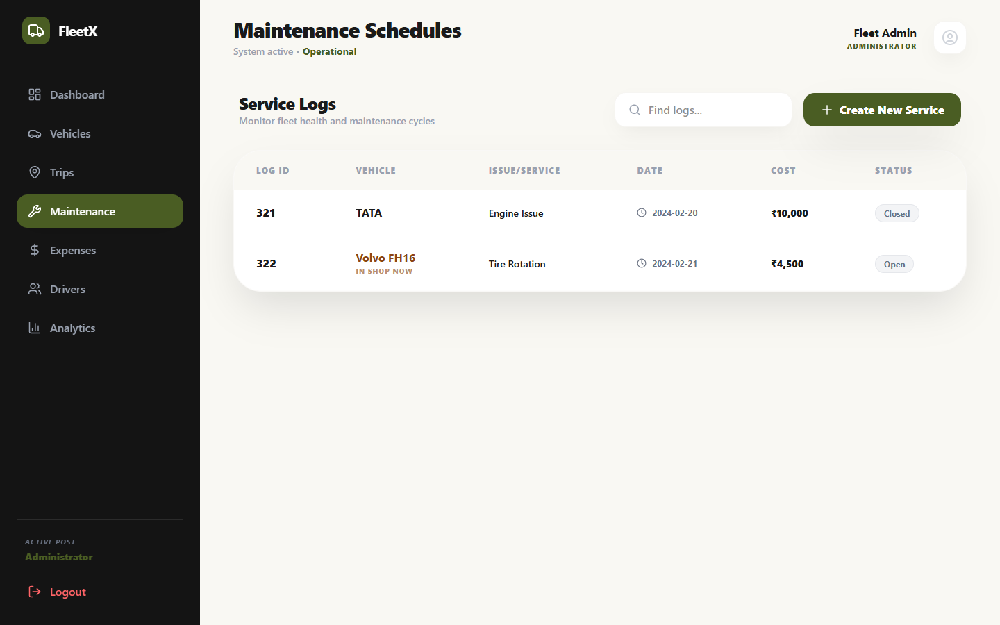
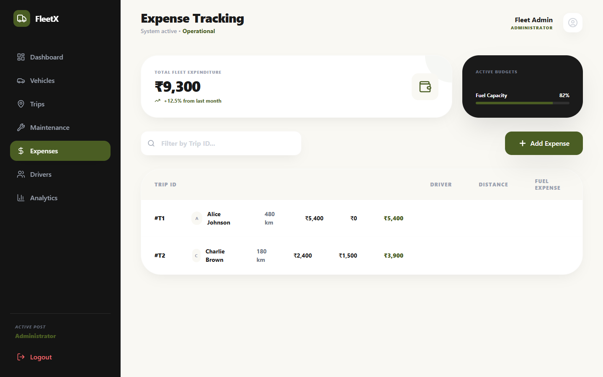
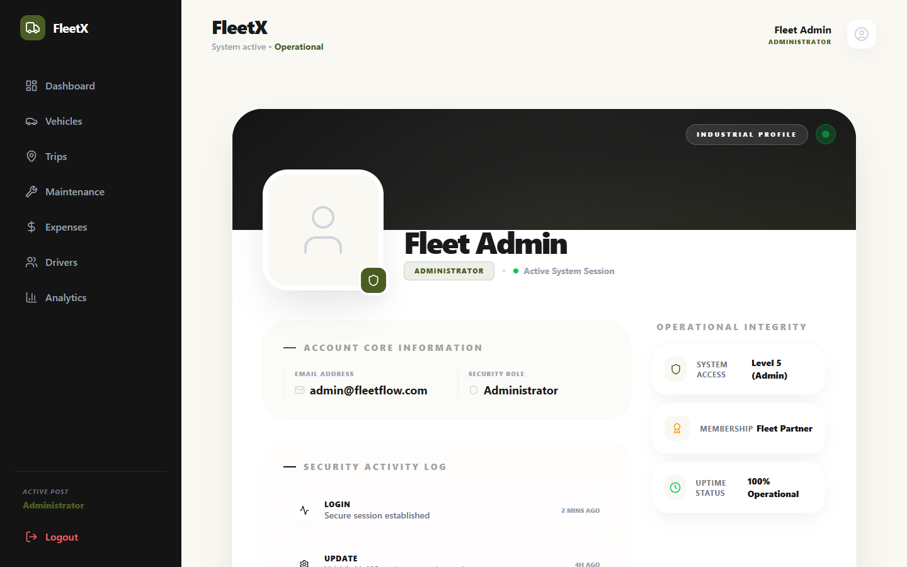

<div align="center">
  
# 🚛 FleetFlow

**Industrial Fleet Management & Logistics Platform**

A premium, full-stack enterprise solution designed to streamline the management of vehicles, track dispatch trips dynamically, monitor active maintenance, and analyze fleet expenditure with granular precision.

[](https://reactjs.org/)
[](https://vitejs.dev/)
[](https://tailwindcss.com/)
[](https://opensource.org/licenses/MIT)

</div>

---

## 📸 Application Interface & Core Modules

Our interface is built with premium aesthetics, offering glassmorphism design, native dark mode integrations, and responsive micro-animations for an elevated user experience.

### Secure Authentication & Dashboard Command
> **Registration (Left):** A clean entry point requiring corporate identity and operator codes designed around intuitive Auth layouts.  
> **Dashboard Overview (Right):** The central nervous system of the app, heavily featuring vital fleet metrics, live active dispatches, maintenance alerts, and recent log KPIs.

<div align="center">
  
  
</div>
<br>

### Fleet & Logistics Management
> **Vehicle Registry (Left):** Real-time monitoring of all industrial fleet assets showing active availability, odometer progressions, and physical capacity.  
> **Trip Dispatch (Right):** A dynamic map-enabled logistics hub allowing operators to assign routes, configure cargo weight, and manage drivers in real-time.

<div align="center">
  
  
</div>
<br>

### Operational Maintenance & Financials
> **Maintenance Bay (Left):** Active logging for mechanical repairs to proactively isolate faulty vehicles and prevent severe deployment downtime.  
> **Expense Analytics (Right):** Visual data reporting charts and tabular statistics calculating ROI against critical fuel expenditures and maintenance costs.

<div align="center">
  
  
</div>
<br>

### Operator Intelligence
> **Corporate Identity Profile:** Dedicated operational command space letting authorized users review clearance levels, overview platform security settings, and configure unit system preferences.

<div align="center">
  
</div>

---

## 🌟 Core Features

| Feature | Capabilities |
| :--- | :--- |
| **🛡️ Advanced Security** | JWT-protected authentication with state-of-the-art bcrypt hashing and robust Role-Based Access Control (RBAC). |
| **📊 Intelligent Dashboard** | Live Key Performance Indicators (KPIs), fleet utilization scores, and real-time active dispatch monitoring. |
| **🚗 Vehicle Registry** | Comprehensive inventory management. Track vehicle license plates, capacities, availability status, and odometer logic. |
| **🗺️ Dispatch & Trip Logs** | Industrial-level trip creation flow. Assign drivers, calculate operational distance, and enforce lifecycle rules. |
| **🔧 Maintenance Shop** | Log servicing records with estimated costs. Automatically shift vehicle statuses to "In Shop" to prevent false dispatches. |
| **💰 Expense Engines** | Deep financial insights calculating total fuel consumption metrics against maintenance costs to report fleet ROI. |
| **⚙️ Corporate Profiles** | Deep activity logging, security oversight, and user detail tracking dynamically rendered based on the employee's role tier. |

---

## 🏗️ Technical Architecture

FleetFlow follows a monolithic separation of concerns, strictly isolating the client application logic from the database and API governance.

### Frontend Client
- **Core:** React 19, Vite, JavaScript (ESM)
- **State Management:** Zustand (for lightweight, scalable flux patterns)
- **Styling:** Vanilla CSS layered on Next-Gen Tailwind CSS utility systems
- **Routing:** React Router v7 with Client-Side Route Guards matching user tiers
- **Icons & Assets:** Lucide React, Framer Motion (for fluid rendering)
- **Telemetry Layer:** Leaflet.js with OpenStreetMap (OSM) tile support for accurate, real-world geospatial tracking.

### Backend API Server
- **Runtime:** Node.js powered by Express.js framework
- **Database Architecture:** MongoDB Atlas mapped via Mongoose schemas
- **Auth Engine:** JSON Web Tokens (JWT) for stateless transmission
- **Validation & Business Logic:** Centralized service controllers

---

## 👥 Role-Based Access Control (RBAC)

Access and feature visibility are strictly governed by the user's corporate designation:

| Corporate Role | 📊 Dashboard | 🚗 Vehicles | 🗺️ Trips | 🔧 Maintenance | 💰 Expenses |
|---|:---:|:---:|:---:|:---:|:---:|
| **Administrator** | ✅ Full Access | ✅ Full Access | ✅ Full Access | ✅ Full Access | ✅ Full Access |
| **Fleet Manager** | ✅ Overview | ✅ Edit/Manage | ✅ Dispatch | ✅ Schedule | ✅ View/Audit |
| **Dispatcher** | ✅ Overview | ✅ View Logs | ✅ Direct Routing | ❌ Restricted | ❌ Restricted |
| **Safety Officer** | ✅ Alerts Only | ✅ Compliance | ❌ Restricted | ✅ Edit/Inspect | ❌ Restricted |
| **Financial Analyst**| ✅ Fiscal Data | ❌ Restricted | ❌ Restricted | ❌ Restricted | ✅ Full Access |

---

## 🎬 Video Showcase Script (Official)
This project is designed for professional demonstration. Below is the official 3-minute showcase script.

> [!TIP]
> **Video Length**: ~3 Minutes | **Vibe**: Professional / Industrial / Tech-Focused

### **I. Introduction (0:00 - 0:45)**
"Welcome to FleetEdge—an enterprise-grade fleet intelligence and mission command terminal. We’ve built a 'Command Center' aesthetic from the ground up—prioritizing high-density information display and a premium, immersive user experience."

### **II. Technical Stack (0:45 - 1:30)**
"Powered by a high-performance MERN stack. We use Node.js and Express for the backend, and MongoDB for flexible data storage. On the frontend, React and Vite handle near-instant rendering, while Zustand provides lightweight global state synchronization."

### **III. Custom Security (1:30 - 2:15)**
"FleetEdge features a custom JWT-based Authentication System. Our onboarding flow is seamless—new operators select their roles (Admin, Manager, Dispatcher) during registration, instantly triggering Role-Based Access Control (RBAC) across the entire platform."

### **IV. Analytics & Operations (2:15 - 3:00)**
"Mission Control provides real-world geospatial tracking. The Analytics Hub offers granular insights into ROI, fuel costs, and asset utilization, correlating financial data directly with Mission IDs for 100% financial veracity."

---

## 🚀 Getting Started

Follow these instructions to deploy the standard development environment on your local system.

### Prerequisites
- [Node.js (v18.0.0 or higher)](https://nodejs.org/)
- [MongoDB Atlas Cluster](https://www.mongodb.com/) or local MongoDB instance.

### 1. Repository Setup
```bash
# Clone the repository
git clone https://github.com/your-username/FleetFlow.git

# Navigate into the project payload
cd FleetFlow/OdooXGJVidhyaPith
```

### 2. Backend Initialization
The Express.js REST API runs isolated on Port 5000.

```bash
cd backend

# Install dependencies
npm install
```

Create a `.env` configuration file in the `backend/` directory:
```env
PORT=5000
MONGO_URI=mongodb+srv://<your_username>:<your_password>@cluster.mongodb.net/fleetflow
JWT_SECRET=super_secret_enterprise_key_2026
```

Start the server:
```bash
# Runs persistent nodemon monitoring
npm run dev 
```

### 3. Frontend Initialization
The React/Vite development server runs on Port 5173.

```bash
cd frontend

# Install dependencies
npm install

# Start the Vite Hot-Module-Replacement interface
npm run dev
```

The application client will be available at **`http://localhost:5173`**.

---

## 📂 Project Directory Map

```text
OdooXGJVidhyaPith/
├── backend/
│   ├── config/           # Database initialization layers
│   ├── controllers/      # Functional request/response handlers
│   ├── middleware/       # System intercepts (JWT Auth Verification)
│   ├── models/           # NoSQL Mongoose Schemas (Vehicle, Driver, Trip, Expense)
│   ├── routes/           # Defined architectural API endpoints
│   ├── services/         # Decoupled business rules and calculations
│   └── server.js         # Backend Entry Node
│
├── frontend/
│   ├── src/
│   │   ├── components/   # Modular, declarative React UI Blocks
│   │   ├── layout/       # Frame structural scaffolding (Topbars, Sidebars)
│   │   ├── mock/         # Redundancy seeding data 
│   │   ├── pages/        # High-order page compositions
│   │   ├── store/        # Zustand global states (fleetStore.js)
│   │   ├── App.jsx       # Client router and guard configurations
│   │   └── main.jsx      # DOM Mounting 
│   └── index.html        # Shell File
│
├── screenshots/          # Cached UI rendering snapshots for preview
└── README.md             # This document
```

---

## 🚀 Future Roadmap
- **Predictive Maintenance**: ML models to predict asset failure.
- **Route Optimization**: AI-driven pathfinding to minimize fuel consumption.
- **Mobile Companion**: Native iOS/Android clients for on-field updates.

---

## 🤝 Contribution Policies

Enterprise contributions are welcome. For major overhauls or feature additions, please explicitly open an issue to discuss design strategies before pushing structural changes to active branches. 

## 📄 Licensing

This software is distributed under the proprietary **MIT License**. Copyright © 2026 FleetFlow Enterprise Logistical Systems.
